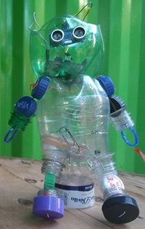

<div align="center">

</div>

<hr>

[Versão em Portugês](/README_ptBR.md)


<hr>

## 🤓  Learn to Code by Building Your Own Robot.

**Robô Educa** is an innovative platform that teaches programming to children aged 6 to 14, promoting inclusion and sustainability ♻️. The journey begins with an inspiring story of two siblings, Suzy and Otávio, who wish to build a robot 🤖 and receive help from their teacher Carlos Sales 👨‍🏫. He encourages them to create their own humanoid robot using recycled materials, programming, and cloud technology ♻️💻☁️.

It is in this context that the Robô Educa Web App emerges. Accessible from any smartphone 📱, it becomes the "brain" of the robot 🧠, interacting with the child through audio messages 🗣️, making it accessible even to individuals with visual impairments. Assembling the robot and interacting with the app stimulate motor coordination 🖐️ and creativity ✨, teaching children technological concepts in a playful and inclusive way.

And all the magic performed by the app is made possible by the **Google GEMINI API** 🤖, which allows Robô Educa to understand and respond to children's questions, explain complex concepts 🤯, and conduct gamified quizzes 🎉. This technology available on Google's cloud transforms learning into a natural and fun conversation 😄, opening new perspectives for these children's future 🚀.

## 🤖 How to Test the App:

* Visit: https://robo-educa-gemini-server-xd3gd6y2aa-uw.a.run.app/
* Click on Start;
* Allow microphone access;
* Click on: ENTER AS GUEST;
* Listen to the questions and answer correctly to earn points.

## 📆 History

<div align="center">

</div>

Artificial intelligence is increasingly present in our lives, making it necessary to encourage as many people as possible to take their first steps in understanding this technology, allowing them to become not only users but also protagonists in creating new resources for this technology in the future.

It was with this thought that the Robô Educa project was launched in 2018. It is an inclusive platform for Programming Education where children take their first steps in this universe by building their own robot. At that time, the robot was made from PET bottles and some electronic components such as Arduino, LEDs, resistors, and batteries.

But it was only in 2024, with the advent of Generative AI and the Google GEMINI API, that the robot gained a "brain" capable of responding in an intelligent and rapid manner, making interaction with the child smooth and delightful 😄!

The creator of this project, [Carlos Sales](https://drive.google.com/file/d/1KPPJQhNn_YsWYK6qllP6muns6WlSRyM1/view?usp=sharing), is a Black man from a disadvantaged background, graduated in Data Science and Systems Development. He shares some of his story in the documentary [C0d3rs Championship](https://www.primevideo.com/detail/0GS98CG03BVM7C224YK7KIWXOJ) available on Amazon Prime Video.

<div style="display: flex;">


</div>

## 💪 Impact

Using only a few LEDs, resistors, and batteries, we have impacted hundreds of children in various communities in our city.

With the use of generative artificial intelligence and cloud technology, new possibilities for expanding our robot's cognitive abilities arise. We hope to reach an even larger number of children, now **around the world!**

Visit our [photo gallery](https://photos.app.goo.gl/yJiewdTTsNFtmF846) to learn more about our inclusion workshops conducted in underserved communities in Salvador, Bahia - Brazil.

💪 And you? Did you like it? Then do your part and contribute to this initiative so we can expand our impact even further.

## 💻 Technologies Used in This App

<div align="center">

</div>

- 
- 
- 
- 
- 

## Robô Educa Platform Overview

The **Robô Educa** platform offers a hands-on, creative experience for students by guiding them through the physical assembly of a humanoid robot. This robot is made from recyclable materials or MDF and can be customized with elements such as LEDs, batteries, and other components. Once the physical robot is assembled, students bring it to life using the "brain" of the robot, which is the application described in this code.

The application enables the humanoid robot to perform cognitive functions: hearing, thinking, and speaking. These capabilities are implemented using **Speech-to-Text** and **Text-to-Speech** technologies, allowing the robot to listen to spoken messages, analyze them, and respond with synthesized speech.

## Technology Stack and Architecture

The application is built using open-source tools and hosted on Google Cloud, leveraging its robust infrastructure. The backend is developed in Python using the Flask framework, following the **Service/Repository** design pattern:

- **Service Layer**: Handles the business logic.
- **Repository Layer**: Manages integration with the database.

For data storage, the platform uses a NoSQL database, **Firebase/Firestore**, which offers scalability and flexibility for storing conversations and user data.

## Core Files and Functionality

### Backend - `routes.py`
The `routes.py` file manages all the routes available in the application. This is where different endpoints are defined to handle user interactions and data processing.

```python
# Dependências
from main import app
from flask import render_template, request, session, redirect, url_for, make_response, jsonify
# Serviços
import service.loginService as loginService
import service.talkService as talkService

# Página inicial/Index
@app.route('/')
def home():
    return render_template('index.html')
```

### Frontend - HTML, CSS, and JavaScript
The frontend is implemented using HTML, CSS, and JavaScript, focusing on simplicity and ease of use. It starts by requesting microphone access, which is handled by `mediadevices.js`.

**Microphone Access**:
When the application is launched, it checks for microphone permissions. If it's the user's first time accessing the app, they are prompted to grant permission. This process is managed by the `mediadevices.js` file.

```javascript
async function devices_micPrompt() {
    let permission;
    await navigator.mediaDevices
        .getUserMedia({
            audio: true
        })
        .then(function (stream) {
            permission = "granted"        
        })
        .catch(function (error) {
            if (error.message == "Requested device not found") {
                permission = "notFound";
            } else if (error.message == "Permission denied") {
                permission = "denied";
            } else {
                console.log(error.message)
                permission = 'error';
            }
        });
    return permission;
}
```

**User Authentication**:
The login process is handled by `login.js`, which sends a POST request to the backend to validate the user. If the user does not have valid credentials, they can log in as a guest.

```javascript
async function login(usertype) {    

    let username = document.getElementById('username').value;
    let password = document.getElementById('password').value;    

    displayStartLogin();
    
    await fetch('/login', {
        method: 'POST',
        headers: {
            'Content-Type': 'application/json'
        },
        body: JSON.stringify({ username: username, password: password, usertype: usertype })
    })
    .then(response => response.json())
    .then(data => {

        displayStopLogin();
        
        switch (data.status) {
            case 'success':
                goToPage("interaction");
                break;
            case 'errorUser':
                alert("Usuário inexistente");
                document.getElementById("username").focus();
                break;
            case 'errorPwd':
                alert("Senha incorreta");
                document.getElementById("password").focus();
                break;
            case 'errorGuest':
                alert("Não foi possível criar usuário temporário. Tente novamente!");                
                break;                
            default:
                break;
        }        
    });
    
}
```

**Interaction**:
After successful login, the interaction begins on the frontend with the `interaction.html` file. The visual interface, managed by `display.js`, is straightforward, with elements symbolizing listening, thinking, and speaking.

**Continuous Listening and Speech Processing**:
The robot starts with a greeting and invites the user to participate in a programming quiz. After speaking, the app activates the microphone in continuous mode, listening to the user's speech. These tasks are performed by `Talk.js`, which utilizes the `Media Devices`, `SpeechRecognition()`, and `SpeechSynthesisUtterance()` APIs.

```javascript
// Este evento é acionado quando o reconhecimento de voz captura um resultado
recognition.onresult = event => {    
    const transcript = event.results[event.resultIndex][0].transcript;    
    talk(transcript);           // Envia transcrição do audio falado pelo usuário para o backend processar junto à Inteligência Artificial e dar uma respectiva resposta
};

// Verifica se usuário não estiver falando (reproduzindo audio). Após 1 minuto de inatividade, interrrompe reconhecimento e exibe botão de pausa
recognition.onend = () => {
    if (speakStatus == false) {     
        timestampAtual = Date.now();
        var diferenca = timestampAtual - timestampParam;
        var minutosPassados = diferenca / (1000 * 60);
        if (minutosPassados < 1) {
            recognition.start(); // Inicia o reconhecimento de voz
        } else {
            hideAllExceptClose();
            showElement("divPauseStart");
        }
    }        
};
```

### Cognitive Processing with Google Gemini API

When a complete phrase is detected, it is sent to the backend for cognitive processing. This is accomplished using the **GEMINI API**, which leverages the `gemini-1.5-flash` model for quick and accurate responses, ensuring fluid conversations that make the robot more engaging and lifelike.

```python
import google.generativeai as genai

# Interação com a Google Gemini API
def talk(userMessage):
    # Obtem ID do usuário logado
    user_id = session["userId"]

    # Obtem histórico de mensagens do usuário
    message_history = messageHistory.getById(user_id)
    message_history_gemini_format = format_messages_for_gemini(message_history)   
    
    # Salva mensagem do usuário em banco de dados
    role = "user"                                       # role=user => mensagem enviada pelo usuário
    messageHistory.store(user_id, role, userMessage)    

    # Inicia interação com Gemini AI
    try:
        convo = model.start_chat(history = message_history_gemini_format) # Inicia chat, contextualizando a IA com o histórico da conversação
        convo.send_message(userMessage)                     # envia nova mensagem para ser processada pela IA
        bot_response = convo.last.text                      # Obtem resposta da IA
    except:
        bot_response = "error"

    # Salva resposta do Bot em banco de dados
    if bot_response != "error":
        role = "model"                                      # role=model => mensagem enviada pela IA
        messageHistory.store(user_id, role, bot_response)    
    else:
        bot_response = "Desculpe, não foi possível obter resposta da Inteligência Artificial."

    response = {"status": "success", "message": bot_response}
    return response
```

### Data Storage and Personalization

The platform stores each user's conversation in Firestore using NoSQL collections. This ensures safety and security for children, while also allowing for moderation and personalization of content.

```python
import time
import repository.db_resource as dbr

# Instância de conexão com banco de dados NoSQL Google Firestore
db = dbr.firestore_resource()       

# Obtem histórico de mensagens a partir do ID do usuário
def getById(user_id):
    collection = f"message_history_{user_id}"
    messages_ref = db.collection(collection).order_by("timestamp")
    messages = messages_ref.stream()

    return messages

# Salva mensagem para recuperação de histórico de conversa na contextualização da resposta
def store(user_id, role, message):
    collection = f"message_history_{user_id}"
    try:
        doc_ref = db.collection(collection).document()
        doc_ref.set({
            "timestamp": int(time.time()),
            "role": role,
            "parts": [message]
        })    
    except Exception as e:
        print(f"Erro ao salvar mensagem no banco de dados. Detalhes: {e}")
        return False
```

### Conclusion

Robô Educa combines physical creativity with cutting-edge AI to create an interactive, educational experience for children. The platform's modular architecture and use of modern web technologies make it scalable, secure, and adaptable to various learning environments.

## ✍️ How to Run This App on Your Windows PC

1. Clone the repository:
```
$ git clone https://github.com/Robo-Educa/robo-educa-gemini-server.git 
```
2. Install dependencies:
```
$ cd robo-educa-gemini-server
$ pip install -r requirements.txt
```
3. Create a .ENV file from .ENV.EXAMPLE and fill in the environment variable values according to your project.

4. Run the project:
```
$ python main.py
```
5. Test in the Browser:
```
http://localhost:5000
```

## ☁️ How to Deploy on Google Cloud (Cloud Run)


* In the Google Cloud Platform console, create a Project.
* Make sure you have the gcloud CLI (Google Cloud SDK Shell) installed on your Windows PC.
* In a Google Cloud SDK Shell terminal, navigate to the folder where your project is located and initialize your connection by providing your email, project, and default region for hosting your App:
```
$ cd\[path do projeto]
$ gcloud init
```
* Deploy your App:
```
$ gcloud run deploy --source .
```
* In the Google Cloud Platform console, select your project.
* In the navigation menu, select: FireBase-Firestore
* Create a Native Database
* Download a JSON file containing access credentials for your database:
    * IAM & Admin / Service Accounts / Click on the Service Account: **Default compute service account**
    * Keys / Add Key / Create New Key / JSON / Create
    * The JSON file will be automatically downloaded.
* In the navigation menu, select: Google Cloud Storage
* Create a private Bucket. Save the JSON file containing database access credentials in this Bucket.
* In the navigation menu, select: Cloud Run
* Click on the Application
* Click on: "Edit and deploy a new version"
    * Click on Volumes / Add a Volume referring to the Bucket containing the database credentials
    * Type: Cloud Storage Bucket
    * Go to the Containers tab / Volume Mounting / Mount Volume
    * Select the name of the created volume
    * Mount Path: specify a name that will serve as a path. E.g., /config
    * Finish / Deploy
* Click again on: Edit and deploy a new version
* Variables and Secrets / Add the same variables contained in the .ENV.example file
    * Note the variable PATH_CREDENTIAL_FIRESTORE should contain the path to the newly created volume. E.g., /config/credential.json
    * Note the variable API_KEY should contain a valid key that can be obtained from: https://aistudio.google.com
* Caution: Be careful with the JSON file containing the database access credentials and your Gemini API_KEY. Never expose them publicly; use secrets or other security measures recommended by Google Cloud.

## 📄 License

This project is licensed under the [Apache 2.0 License](LICENSE). Also, see the Terms of Service.

## 🤝 Contributions

Contributions are welcome! Feel free to open a pull request or contribute in any other way.

* Contacts/WhatsApp: +55 (71) 9.9341-6896
* E-mail: roboeduca.net@gmail.com

<div style="display: flex;">


</div>