<div align="center">
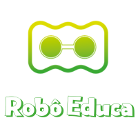
</div>

<hr>

[Versão em Portugês](/README_ptBR.md)


<hr>

## 🤓 Learn to code by building your own robot.

Robô Educa is an innovative platform that teaches programming to children aged 6 to 14, promoting inclusion and sustainability 🤝♻️. The journey begins with an inspiring story of two siblings, Suzy and Otávio, who want to build a robot 🤖 and count on the help of their teacher Carlos Sales 👨‍🏫 who encourages them to build their own humanoid robot using recycled materials, programming, and the cloud ♻️💻☁️.

It is in this context that the Robô Educa Web Application emerges, which is accessible from any smartphone 📱 and becomes the "brain" of the robot 🧠 interacting with the child through audio messages 🗣️ making it accessible even for visually impaired people. The assembly of the robot and interaction with the application stimulates motor coordination 🖐️ and creativity ✨ teaching the child technological concepts in a playful and inclusive way.

And all the magic done by the application is only possible due to the use of the **Google GEMINI API** 🤖 which allows Robô Educa to understand and answer the child's questions, explain complex concepts 🤯 and perform gamified quizzes 🎉. This technology available in Google's cloud turns learning into a natural and fun conversation 😄 opening new perspectives for the future of these children 🚀.

## 🤖 How to test the app:
* Access: https://robo-educa-gemini-server-xd3gd6y2aa-uw.a.run.app/
* Click on Start;
* Authorize the use of the Microphone;
* Click on: ENTER AS VISITOR;
* Listen to the questions and answer correctly to accumulate points.

## 💪 History of Social Impact

Since 2018, when we were only using LEDs, batteries, and resistors, we have impacted hundreds of children in various impoverished communities in the city of **Salvador, Bahia - Brazil**.

The mastermind behind this project, [Carlos Sales](https://drive.google.com/file/d/1KPPJQhNn_YsWYK6qllP6muns6WlSRyM1/view?usp=sharing), is a black man from a peripheral area who graduated in Data Science and Systems Developer. He tells a little about his story in the documentary [C0d3rs Championship](https://www.primevideo.com/detail/0GS98CG03BVM7C224YK7KIWXOJ) available on Amazon Prime Video.

But it was only in 2024, with the advent of **Generative AI** and the **Google GEMINI API**, that the robot began to have a **brain** capable of responding intelligently and quickly, making the interaction with the child fluid and enchanting 😄!

<div style="display: flex;">
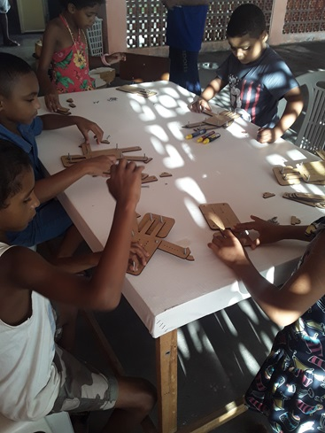
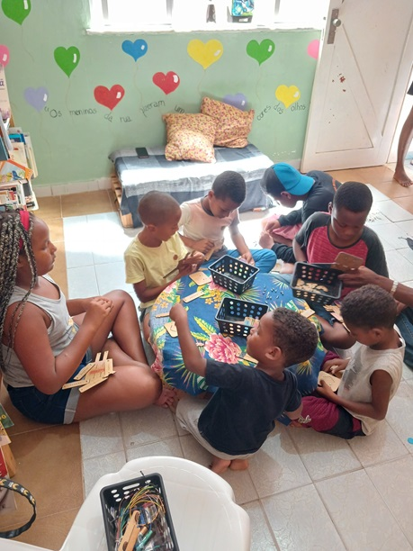
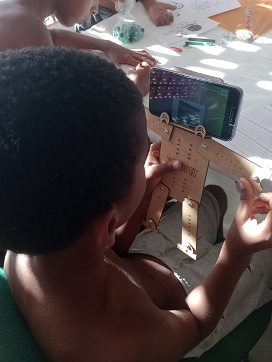
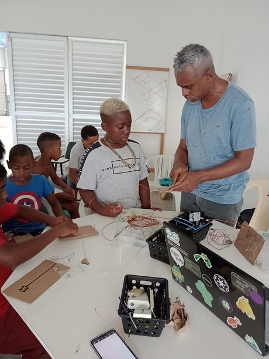
</div>

📸 Visit our [photo gallery](https://photos.app.goo.gl/yJiewdTTsNFtmF846) to learn more about our digital inclusion workshops.

## How things work

### 👤 BODY

The **Robô Educa** platform offers a practical and creative experience for students, guiding them in the physical assembly of a humanoid robot. This robot can be made with recyclable materials like PET bottles or MDF wood kits. After the physical assembly, students bring the robot to life using its "brain," which is the application contained in this repository.

<div style="display: flex;">
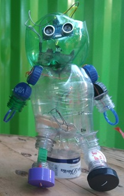
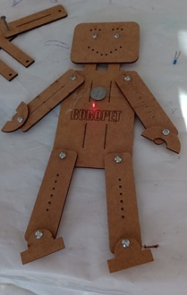

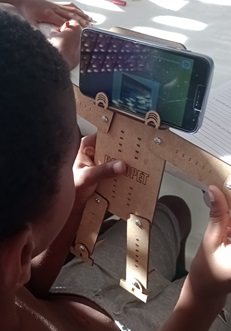
</div>

### 🧠 BRAIN

The application, the robot's brain, allows it to perform cognitive functions such as listening, thinking, and speaking. 

#### Technology Stack 

<div align="center">
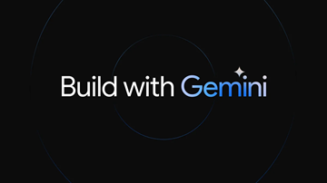
</div>

- 
- 
- 
- 
- 

<hr>

### Architecture

The application is developed using open-source tools and hosted on **Google Cloud**, leveraging its robust infrastructure. The backend is developed in Python using the Flask framework, following the **Service/Repository** design pattern:

- **Service Layer**: Handles business logic.
- **Repository Layer**: Manages integration with the database.

For data storage, the platform uses a NoSQL database, **Firebase/Firestore**, which offers scalability and flexibility to store conversations and user data.

### Main Files and Functionalities


### Backend - `routes.py`
The `routes.py` file manages all available routes in the application. This is where different endpoints are defined to handle user interactions and data processing.

```python
# Dependências
from main import app
from flask import render_template, request, session, redirect, url_for, make_response, jsonify
# Serviços
import service.loginService as loginService
import service.talkService as talkService

# Página inicial/Index
@app.route('/')
def home():
    return render_template('index.html')
```

### Frontend - HTML, CSS and JavaScript


The frontend is implemented using HTML, CSS, and JavaScript, focusing on simplicity and ease of use. It starts by requesting access to the microphone, which is managed by `mediadevices.js`.

#### Microphone Access:


When the application is launched, it checks the permissions for microphone usage. If it is the first time the user accesses the app, they will be prompted to grant permission. This process is managed by the `mediadevices.js` file. 

```javascript
async function devices_micPrompt() {
    let permission;
    await navigator.mediaDevices
        .getUserMedia({
            audio: true
        })
        .then(function (stream) {
            permission = "granted"        
        })
        .catch(function (error) {
            if (error.message == "Requested device not found") {
                permission = "notFound";
            } else if (error.message == "Permission denied") {
                permission = "denied";
            } else {
                console.log(error.message)
                permission = 'error';
            }
        });
    return permission;
}
```

#### User Authentication:
The login process is managed by `login.js`, which sends a POST request to the backend to validate the user. If the user does not have valid credentials, they can log in as a guest. 

```javascript
async function login(usertype) {    

    let username = document.getElementById('username').value;
    let password = document.getElementById('password').value;    

    displayStartLogin();
    
    await fetch('/login', {
        method: 'POST',
        headers: {
            'Content-Type': 'application/json'
        },
        body: JSON.stringify({ username: username, password: password, usertype: usertype })
    })
    .then(response => response.json())
    .then(data => {

        displayStopLogin();
        
        switch (data.status) {
            case 'success':
                goToPage("interaction");
                break;
            case 'errorUser':
                alert("Usuário inexistente");
                document.getElementById("username").focus();
                break;
            case 'errorPwd':
                alert("Senha incorreta");
                document.getElementById("password").focus();
                break;
            case 'errorGuest':
                alert("Não foi possível criar usuário temporário. Tente novamente!");                
                break;                
            default:
                break;
        }        
    });
    
}
```

#### Interaction:
After successful login, interaction begins on the frontend with the `interaction.html` file. The visual interface, managed by `display.js`, is simple, with elements that symbolize listening, thinking, and speaking.

**Continuous Listening and Speech Processing**:
The robot starts with a greeting and invites the user to participate in a programming quiz. After speaking, the app activates the microphone in continuous mode, listening to what the user says. These tasks are performed by `Talk.js`, which uses the `Media Devices`, `SpeechRecognition()`, and `SpeechSynthesisUtterance()` APIs. 

#### To hear


```javascript
recognition = new SpeechRecognition();
recognition.lang = "pt-BR";
recognition.continuous = true;      // Reconhecimento contínuo em loop
recognition.interimResults = false; // resultados parciais

// Este evento é acionado quando o reconhecimento de voz captura um resultado
recognition.onresult = event => {    
    const transcript = event.results[event.resultIndex][0].transcript;    
    talk(transcript);           // Envia transcrição do audio falado pelo usuário para o backend processar junto à Inteligência Artificial e dar uma respectiva resposta
};

// Verifica se usuário não estiver falando (reproduzindo audio). Após 1 minuto de inatividade, interrrompe reconhecimento e exibe botão de pausa
recognition.onend = () => {
    if (speakStatus == false) {     
        timestampAtual = Date.now();
        var diferenca = timestampAtual - timestampParam;
        var minutosPassados = diferenca / (1000 * 60);
        if (minutosPassados < 1) {
            recognition.start(); // Inicia o reconhecimento de voz
        } else {
            hideAllExceptClose();
            showElement("divPauseStart");
        }
    }        
};
```

#### To speak


```javascript
// Sintese de Fala - faz o dispositivo reproduzir uma mensagem através de seus autofalantes/fones
function speak(message) {
    message = removerEmojis(message);
    const utterThis = new SpeechSynthesisUtterance(message);
    utterThis.pitch = 2;
    utterThis.rate = 4;

    utterThis.onstart = function () {
        hideAllExceptClose();                   // Oculta elementos que estiverem visiveis na tela
        showElement("divSpinnerWaves");                
    };

    utterThis.onend = function () {        
        speakStatus=false;
        hideAllExceptClose();                   // Oculta elementos que estiverem visiveis na tela
        showElement("divSpinnerRipple");        // Exibe Spinner simulando ondulaçao de escuta 
        recognition.start();                    // Inicia o reconhecimento de voz 
        timestampParam = Date.now();       
    };

    recognition.stop();                         // Ao iniciar a fala (reprodução do audio) Interrompe o reconhecimento de voz
    speakStatus=true;                           // Speaking     on=true  off=false
    synth.speak(utterThis);                     // inicia a reprodução da mensagem    
}

// Remove emojis da mensagem, para que a mesma possa ser reproduzida via sintese de fala
function removerEmojis(texto) {
    return texto
        .replace(/\p{Emoji}/gu, '') // Remove emojis
        .replace(/\s+/g, ' ') // Remove espaços em branco extras
        .trim(); // Remove espaços em branco no início e no fim
}
```

### 🧠 Cognitive Processing with the Google Gemini API


When a complete sentence is detected, it is sent to the backend for cognitive processing. This is done using the **GEMINI API**, which leverages the `gemini-1.5-flash` model for fast and accurate responses, ensuring fluid conversations that make the robot more engaging and realistic.

For prompt engineering, we use the **Zero-Shot Prompting** technique combined with a feature of the GEMINI SDK, **System instructions**, which provide a frame of reference for the model, helping it understand the task and respond appropriately without needing specific examples. 

```python
import google.generativeai as genai

genai.configure(api_key=my_api_key)
model = genai.GenerativeModel(model_name=ai_model,
        generation_config=generation_config,
        system_instruction=system_instruction,
        safety_settings=safety_settings)

# Interação com a Google Gemini API
def talk(userMessage):
    # Obtem ID do usuário logado
    user_id = session["userId"]

    # Obtem histórico de mensagens do usuário
    message_history = messageHistory.getById(user_id)
    message_history_gemini_format = format_messages_for_gemini(message_history)   
    
    # Salva mensagem do usuário em banco de dados
    role = "user"                                       # role=user => mensagem enviada pelo usuário
    messageHistory.store(user_id, role, userMessage)    

    # Inicia interação com Gemini AI
    try:
        convo = model.start_chat(history = message_history_gemini_format) # Inicia chat, contextualizando a IA com o histórico da conversação
        convo.send_message(userMessage)                     # envia nova mensagem para ser processada pela IA
        bot_response = convo.last.text                      # Obtem resposta da IA
    except:
        bot_response = "error"

    # Salva resposta do Bot em banco de dados
    if bot_response != "error":
        role = "model"                                      # role=model => mensagem enviada pela IA
        messageHistory.store(user_id, role, bot_response)    
    else:
        bot_response = "Desculpe, não foi possível obter resposta da Inteligência Artificial."

    response = {"status": "success", "message": bot_response}
    return response
```

### Content for Children - Safety in Model Behavior

The **Google Gemini API** offers a feature called `safety_settings` that allows you to control the language model's behavior in terms of safety, especially in conversations with children. When instantiating the model, it is possible to define the desired levels of protection against inappropriate or dangerous content.

```python
safety_settings = [  
  {
    "category": "HARM_CATEGORY_HARASSMENT",
    "threshold": "BLOCK_LOW_AND_ABOVE"
  },
  {
    "category": "HARM_CATEGORY_HATE_SPEECH",
    "threshold": "BLOCK_LOW_AND_ABOVE"
  },
  {
    "category": "HARM_CATEGORY_SEXUALLY_EXPLICIT",
    "threshold": "BLOCK_LOW_AND_ABOVE"
  },
  {
    "category": "HARM_CATEGORY_DANGEROUS_CONTENT",
    "threshold": "BLOCK_LOW_AND_ABOVE"
  }
]
genai.configure(api_key=my_api_key)
model = genai.GenerativeModel(model_name=ai_model,
        generation_config=generation_config,
        system_instruction=system_instruction,
        safety_settings=safety_settings)
```

Where:

**category**: The specific category of harmful content you want to block. Available categories are:

* HARM_CATEGORY_HARASSMENT: Blocks content that may be considered bullying, harassment, or stalking.
* HARM_CATEGORY_HATE_SPEECH: Blocks content that promotes hatred, violence, or discrimination against specific groups.
* HARM_CATEGORY_SEXUALLY_EXPLICIT: Blocks sexually explicit or suggestive content.
* HARM_CATEGORY_DANGEROUS_CONTENT: Blocks content that may be considered dangerous, such as instructions for dangerous activities or information on how to manufacture weapons.

And:

**threshold**: The parameter that defines the level of strictness with which the model should block content within a given category. The selected value was:

**BLOCK_LOW_AND_ABOVE**: Blocks any content within the category that is considered "low", "medium", or "high" in terms of risk. This is the highest security level and is appropriate for environments where child protection is a priority.

### Data Storage and Personalization


The platform stores each user's conversation in a **Firestore** database using NoSQL collections. This generates at least two major benefits:

* Ensure safety in the event of a need for moderation;
* Allow content personalization.

And regarding content personalization, **Google GEMINI** is capable of handling up to **2 million Tokens**. This represents a considerable volume of data, capable of storing a significant amount of information and interactions for educational content personalization.

Some practical applications for using this capacity:

1. Detailed Learning Histories:

***Progress Mapping***: Storing a complete history of a student's interactions, such as responses to exercises, tests, debates, feedback, time spent on each subject, etc., allows progress to be mapped in a granular and individualized manner.

***Pattern Identification***: Analyzing this data allows you to identify behavioral patterns, areas of difficulty, strengths, and learning styles for each student.

2. Creating Personalized Learning Paths:

***Intelligent Recommender***: Based on history, the system can recommend specific content, activities, exercises, and resources for each student, adapting the pace and difficulty level.

***On-Demand Content:*** The model can generate supporting materials, additional explanations, summaries, or examples on specific topics where the student demonstrates difficulties.

3. Personalized and Interactive Feedback:

***Response Analysis:*** The model can analyze responses, identifying errors, knowledge gaps, and areas that need reinforcement.

***Adaptive Feedback:*** Feedback can be personalized with clear explanations, examples, and specific tips for each student, increasing learning and retention. 

### Conclusion

Robô Educa combines physical creativity with cutting-edge artificial intelligence to create an interactive and educational experience for children. The platform's modular architecture and use of modern web technologies make it scalable, secure, and adaptable to diverse learning environments.

## ✍️ How to run this application on your Windows PC

1. Clone the repository:
```
$ git clone https://github.com/Robo-Educa/robo-educa-gemini-server.git 
```
2. Install dependencies:
```
$ cd robo-educa-gemini-server
$ pip install -r requirements.txt
```
3. Create a .ENV file from .ENV.EXAMPLE and fill in the environment variable values according to your project.

4. Run the project:
```
$ python main.py
```
5. Test in the Browser:
```
http://localhost:5000
```
## ☁️ How to deploy to Google's cloud environment (Cloud Run)

* In the Google Cloud Platform console, create a Project 
* Make sure you have installed the gcloud CLI (Google Cloud SDK Shell) on your Windows PC
* In a Google Cloud SDK Shell terminal, go to the folder where your project is located and initialize your connection by providing your email, project, and default region for hosting your App:
```
$ cd\[path of project]
$ gcloud init
```
* Deploy your App:
```
$ gcloud run deploy --source .
```
* In the Google Cloud Platform console, select your project.
* In the navigation menu select: FireBase-Firestore 
* Create a Native type Database
* Download a JSON file containing access credentials to your database:
    * IAM and Administrator / Service Accounts / Click on the service account: **Default compute service account**
    * Keys / Add key / Create new Key / JSON / Create
    * The JSON file will be downloaded automatically
* In the navigation menu select: Google Cloud Storage
* Create a private Bucket. Save the JSON file containing the database access credentials in this Bucket
* In the navigation menu select: Cloud Run 
* Click on the Application
* Click on: "Edit and deploy a new version"
    * Click on Volumes / Add a Volume referring to the Bucket containing the database credential
        * Type: Cloud Storage Bucket
        * Access the Containers / Volume Mount tab / Mount Volume
        * Select the name of the volume created 
        * Mount Path: specify a name that will serve as a path. Ex: /config
        * Finish / Deploy
* Click again on: Edit and deploy a new version
    * Variables and Secrets / Add the same variables contained in the .ENV.example file
        * Pay attention to the PATH_CREDENTIAL_FIRESTORE variable which should contain the path of the newly created volume. Ex: /config/credential.json
        * Pay attention to the API_KEY variable which should contain a valid key that can be obtained at: https://aistudio.google.com
* Attention: Be careful with the JSON file containing the database access credential and also with your API_KEY Gemini. Never expose them publicly, use secrets or other recommended security resources from the Google Cloud platform.

## 📄 License

This project is licensed under the [Apache 2.0 License](LICENSE). Please also observe the Terms of Service.

## 🤝 Contributions

Contributions are welcome! Feel free to open a pull request or contribute in any other way.

💪 And you? Did you like it? So do your part and collaborate with this initiative so that we can expand our impact even further.


* Contacts/WhatsApp: +55 (71) 9.9341-6896 
* Email: roboeduca.net@gmail.com

<div style="display: flex;">

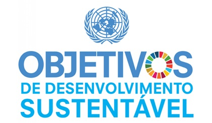
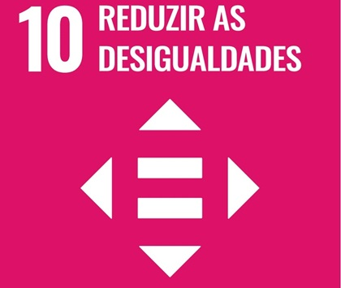
</div>